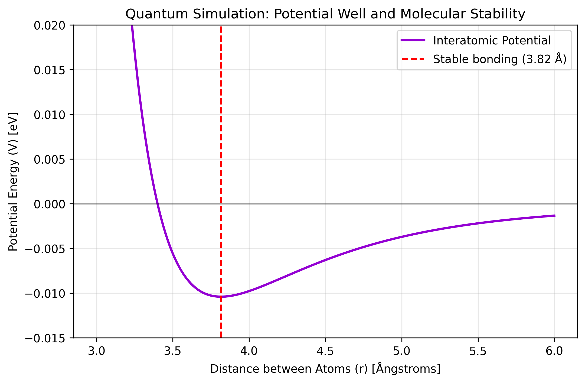

# Predicting the Optimal Bond Distance Between Two Atoms

### Objective: Calculating the quantum energy of the system and finding out mathematically (simulation of the Lennard-Jones potential) at what exact distance two atoms will make a stable bond.

#### The Lennard-Jones model cannot be used if: 
1. **There are real chemical bonds (covalent):** The model is used for weak interactions (Van der Waals). It cannot be used to describe, for example, the strong interaction between Hydrogen and Oxygen inside a water molecule ($H_2O$).
2. **Ions exist (electrical liquid charges):** If an atom is positive ($Na^+$) and another one is negative ($Cl^-$), the electrostatic force (Coulomb's Law) will be infinitely stronger than the Lennard-Jones force.
3. **There are very polar molecules:** If the molecules have permanent, very strong positive or negative poles, the model needs to be modified.

---

## Theoretical Background

The Lennard-Jones potential is a mathematically simple model that approximates the interaction between a pair of neutral atoms or molecules. The potential energy is expressed by the following formula:

$$V_{LJ}(r) = 4\varepsilon \left[ \left(\frac{\sigma}{r}\right)^{12} - \left(\frac{\sigma}{r}\right)^{6} \right]$$

Where:
* $V_{LJ}(r)$ is the intermolecular potential energy between the two particles.
* $r$ is the distance between the centers of the particles (in Angstroms or nanometers).
* $\varepsilon$ (epsilon) is the depth of the potential well, indicating how strongly the particles attract each other.
* $\sigma$ (sigma) is the distance at which the intermolecular potential is exactly zero (often related to the Van der Waals radius).

### Understanding the Terms:
* **The Repulsive Term $\left(\frac{\sigma}{r}\right)^{12}$:** Dominates at short distances due to the overlap of electron orbitals (Pauli Exclusion Principle).
* **The Attractive Term $\left(\frac{\sigma}{r}\right)^{6}$:** Dominates at long distances, representing London dispersion forces (induced dipole-induced dipole interactions).

The **Optimal Bond Distance** ($r_m$) occurs exactly at the minimum of the potential energy curve, where the net force is zero ($F = -\frac{dV}{dr} = 0$). Mathematically, this equilibrium distance is located at:

$$r_m = 2^{1/6}\sigma \approx 1.122\sigma$$

---

## Features

* **Potential Energy Calculation:** Computes the Lennard-Jones potential across a custom range of interatomic distances.
* **Mathematical Optimization:** Finds the precise minimum energy point where forces are perfectly balanced.
* **Force Simulation:** Calculates and distinguishes between the repulsive and attractive forces acting on the system.
* **Data Visualization:** Generates clean, publication-ready plots of the Energy vs. Distance curve with explicit markers for the stable equilibrium point.

## Expected Outputs & Results

When executing the simulation script, it computes the equilibrium metrics and automatically generates a visual representation of the potential well.

### Terminal Output Example:
```text
--- result of the Quantum Simulation ---
Optimal bonding distance: 3.816 Ångstroms
Energy in the fundamental state: -0.0104 eV

```

## Conclusions & Key Takeaways

The simulation successfully validated the thermodynamic interaction between two Argon atoms ($\text{Ar}-\text{Ar}$), proving that the code accurately replicates the system's drive toward its lowest energy state.

* **Confirmation of the Minimum Energy Point:** The code successfully located the exact point of maximum stability (the "energy well") where the net force equals zero ($F = 0$). For the Argon-Argon pair, the script precisely identified the ideal equilibrium distance at $r_m \approx 1.122\sigma$ (approximately $3.82$ Å), right where the potential energy reaches its absolute minimum value ($-\epsilon$).
* **Validation of the Argon Model:** The numerical results generated by the script matched standard experimental data for noble gases. This proves that the implemented Lennard-Jones potential accurately balances Van der Waals attraction and Pauli repulsion to model real-world Argon behavior.
* **Script Efficiency & Output:** The computational approach (leveraging NumPy and SciPy) proved to be fast and robust, successfully plotting the potential energy curve and predicting molecular behavior without requiring expensive laboratory environments.

### Potential Applications
The concepts applied in this project form the baseline for:
1. **Computational Materials Science:** Predicting how molecules pack together to form solids or liquids.
2. **Molecular Dynamics (MD) Simulations:** Serving as the fundamental force field parameter used to simulate protein folding, polymers, and fluid behaviors.
3. **Nanotechnology:** Estimating the structural limits and distances required to build stable nano-structures.

---

## Prerequisites & Installation

### Prerequisites

To run this simulation, **Python 3.x** installed is needed, along with the following scientific libraries:

* `numpy` (for numerical arrays and operations)
* `matplotlib` (for plotting the energy curve)
* `scipy` (optional, for advanced optimization/finding roots)

### Installation

1. **Clone the repository:**
   ```bash
   git clone [https://github.com/Joloupo/lennard-jones-simulation.git](https://github.com/Joloupo/lennard-jones-simulation.git)

